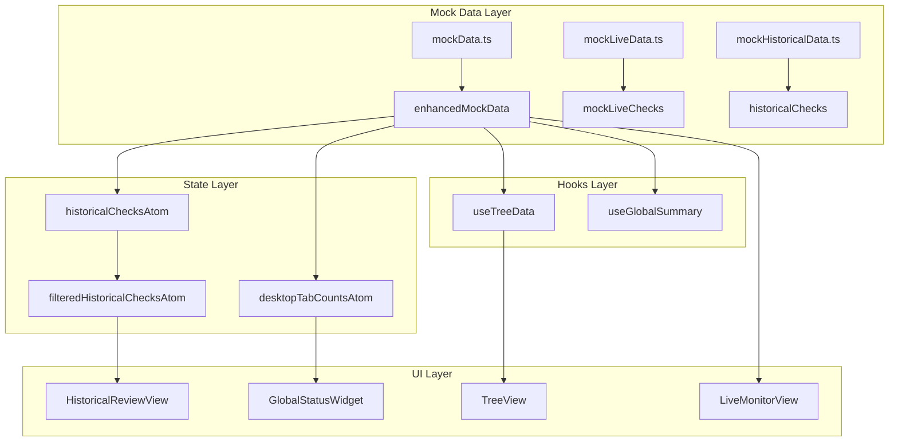

# Data Files Reference

> [!NOTE]
> This document catalogs all mock data and related data files used to drive the Desktop Supervisor Dashboard views.

---

## Primary Mock Data (Desktop Enhanced)

### [mockData.ts](file:///c:/Users/dthompson/Documents/CODE/safeguard-desktop/src/desktop-enhanced/data/mockData.ts)

**Purpose**: Unified data generator for both Live and Historical views

| Export | Type | Description |
|--------|------|-------------|
| `generateEnhancedData()` | Function | Generates fresh `liveData` and `historicalData` |
| `enhancedMockData` | Object | Cached data: `{ liveData, historicalData }` |
| `TOTAL_LIVE_RECORDS` | Number | Count of live records (60) |
| `TOTAL_HISTORICAL_RECORDS` | Number | Count of historical records (~5,760) |
| `loadEnhancedLivePage()` | Function | Paginated loader with filtering |
| `loadEnhancedHistoricalPage()` | Function | Paginated loader with filtering |

**Room Definition**: 60 rooms across 4 groups × 3 units × 5 rooms each

---

## Legacy Mock Data (Desktop Standard)

### [mockLiveData.ts](file:///c:/Users/dthompson/Documents/CODE/safeguard-desktop/src/desktop/mockLiveData.ts)

**Purpose**: Original live check mock data (124 records)

| Export | Description |
|--------|-------------|
| `mockLiveChecks` | Static array of `LiveCheckRow` |
| `TOTAL_LIVE_RECORDS` | 8,914 (simulated server count) |
| `loadLiveChecksPage()` | Paginated loader with 1.5s delay |
| `getLiveCounts()` | Returns `{ missed, due }` counts |

---

### [mockHistoricalData.ts](file:///c:/Users/dthompson/Documents/CODE/safeguard-desktop/src/desktop/mockHistoricalData.ts)

**Purpose**: Original historical check mock data (57 records)

| Export | Description |
|--------|-------------|
| `historicalChecks` | Static array of `HistoricalCheck` |
| `TOTAL_HISTORICAL_RECORDS` | 5,420 (simulated server count) |
| `loadHistoricalChecksPage()` | Paginated loader with 1.5s delay |
| `getHistoricalCounts()` | Returns `{ unreviewed }` count |

---

## Shared Data (Mobile/Desktop)

### [src/data/mock/](file:///c:/Users/dthompson/Documents/CODE/safeguard-desktop/src/data/mock)

| File | Purpose |
|------|---------|
| [checkData.ts](file:///c:/Users/dthompson/Documents/CODE/safeguard-desktop/src/data/mock/checkData.ts) | Core check generation for mobile |
| [facilityData.ts](file:///c:/Users/dthompson/Documents/CODE/safeguard-desktop/src/data/mock/facilityData.ts) | Facility definitions |
| [facilityUtils.ts](file:///c:/Users/dthompson/Documents/CODE/safeguard-desktop/src/data/mock/facilityUtils.ts) | Facility helper functions |
| [residentData.ts](file:///c:/Users/dthompson/Documents/CODE/safeguard-desktop/src/data/mock/residentData.ts) | Resident mock data |

---

## Type Definitions

### [src/desktop/types.ts](file:///c:/Users/dthompson/Documents/CODE/safeguard-desktop/src/desktop/types.ts)

| Type | Usage |
|------|-------|
| `DesktopView` | `'live'` \| `'historical'` |
| `HistoricalCheck` | Historical table row data |
| `DesktopFilter` | Toolbar filter state |
| `LiveCheckRow` | Live table row data |
| `SupervisorNoteReason` | Predefined note reasons |

---

### [src/types.ts](file:///c:/Users/dthompson/Documents/CODE/safeguard-desktop/src/types.ts)

| Type | Usage |
|------|-------|
| `SafetyCheck` | Core check interface (mobile-centric) |
| `SafetyCheckStatus` | `'early'` \| `'pending'` \| `'due'` \| `'missed'` \| etc. |
| `Resident` | `{ id, name, location }` |
| `SpecialClassification` | Risk type info |

---

## State Atoms

### [src/desktop/atoms.ts](file:///c:/Users/dthompson/Documents/CODE/safeguard-desktop/src/desktop/atoms.ts)

| Atom | Persistence | Purpose |
|------|-------------|---------|
| `desktopViewAtom` | ✅ Storage | Current view: live/historical |
| `desktopFilterAtom` | ❌ Session | Filter state for toolbar |
| `selectedHistoryRowsAtom` | ❌ Session | Selected row IDs (historical) |
| `selectedLiveRowsAtom` | ❌ Session | Selected row IDs (live) |
| `historicalChecksAtom` | ❌ Session | Historical data array |
| `filteredHistoricalChecksAtom` | ❌ Derived | Filtered historical checks |
| `activeDetailRecordAtom` | ❌ Session | Currently viewed record in panel |
| `isDetailPanelOpenAtom` | ❌ Session | Panel visibility |
| `panelWidthAtom` | ✅ Storage | Panel resize width |
| `autoRefreshAtom` | ❌ Session | Auto-refresh config |
| `desktopTabCountsAtom` | ❌ Derived | Badge counts for tabs |

---

### [src/desktop-enhanced/atoms.ts](file:///c:/Users/dthompson/Documents/CODE/safeguard-desktop/src/desktop-enhanced/atoms.ts)

| Atom | Purpose |
|------|---------|
| `desktopEnhancedViewAtom` | View mode for enhanced layout |
| `desktopEnhancedSelectionAtom` | Tree navigation selection |

---

### [src/data/atoms.ts](file:///c:/Users/dthompson/Documents/CODE/safeguard-desktop/src/data/atoms.ts)

| Atom | Purpose |
|------|---------|
| `fastTickerAtom` | 60fps heartbeat |
| `throttledTickerAtom` | 10fps for text timers |
| `slowTickerAtom` | 1fps for slow updates |
| `sessionAtom` | User authentication state |
| `connectionStatusAtom` | Online/offline status |
| `appConfigAtom` | Global app config |

---

## Data Flow Diagram

---

## Usage Notes

> [!IMPORTANT]
> The **enhanced** mock data (`mockData.ts`) is the primary data source used by the current desktop-enhanced views. The legacy files (`mockLiveData.ts`, `mockHistoricalData.ts`) are retained for the standard desktop view but may be deprecated.

> [!TIP]
> When modifying mock data distribution (e.g., changing status percentages), update `mockData.ts` line 171-173 for completion rates or lines 95-104 for status timing offsets.
