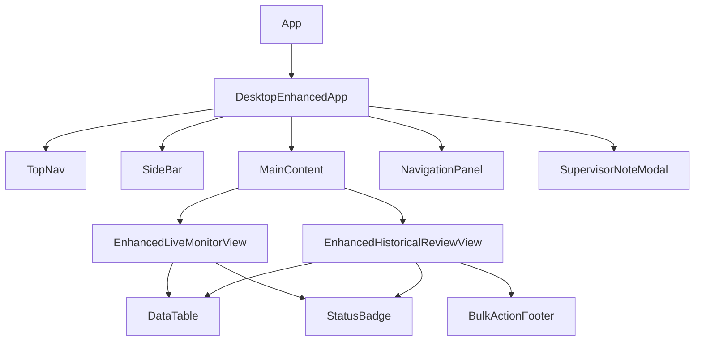

# Implementation Plan - Enhanced Views Refinement

Refining the Live and Historical views to align with user feedback on data presentation, status logic, and filtering.

## Technical Architecture Specification

### 1. Data Model Strategy
- **Unification**: We will unify `LiveCheckRow` and `HistoricalCheck` display logic where possible using a shared `StatusBadge` configuration.
- **Flattening**: Historical records are strictly 1-per-resident. This is handled by the mock generator returning flattened arrays. No complex client-side flattening required.
- **"Missed" State**: The concept of "Overdue" in Live view is purely a UI state derived from `dueDate < now`. We will map this to `Missed` label in the UI but keep the internal status as `overdue` to distinguish from historically "finalized" missed checks if needed, or unify enums.
    - **Decision**: Rename "Overdue" to "Missed" in the UI layer only to preserve existing logic stability.

### 2. Component Hierarchy

### 3. State Management (Jotai Atoms)
- **`desktopFilterAtom`**: Single source of truth for all filters (Live & History).
- **`selectedHistoryRowsAtom`**: Set of IDs for bulk actions.
- **`activeDetailRecordAtom`**: Holds data for the slide-out panel (`NavigationPanel`).
    - *Refinement*: Ensure this atom is cleared when switching views to prevent stale data.

## Risk Analysis
- **Mock Data Skew**: Mock data generation might produce invalid dates (e.g., future dates for history).
    - *Mitigation*: STRICT date clamping in `generateEnhancedData`.
- **Search Performance**: Client-side filtering of 500+ resident records might be slow.
    - *Mitigation*: `useMemo` is already in place; pagination handles rendering.
- **TimeZone Issues**: `new Date().toISOString()` vs local display.
    - *Mitigation*: Consistency in using `toLocaleTimeString` implementation in one place (helper function).

## Proposed Changes

### Data & State

#### [MODIFY] [types.ts](file:///c:/Users/dthompson/Documents/CODE/safeguard-desktop/src/desktop/types.ts)
- Update `DesktopFilter` interface properties.

#### [MODIFY] [mockData.ts](file:///c:/Users/dthompson/Documents/CODE/safeguard-desktop/src/desktop-enhanced/data/mockData.ts)
- Add supervisor fields.
- Ensure "Overdue" status is treated as "Missed".

### Components

#### [MODIFY] [EnhancedLiveMonitorView.tsx](file:///c:/Users/dthompson/Documents/CODE/safeguard-desktop/src/desktop-enhanced/components/EnhancedLiveMonitorView.tsx)
- Unify Status Column.
- Date+Time in Scheduled.

#### [MODIFY] [EnhancedHistoricalReviewView.tsx](file:///c:/Users/dthompson/Documents/CODE/safeguard-desktop/src/desktop-enhanced/components/EnhancedHistoricalReviewView.tsx)
- Unify Status Column.
- Comments -> Last Column.
- Dashes for empty data.

#### [MODIFY] [AdvancedSearchPanel.tsx](file:///c:/Users/dthompson/Documents/CODE/safeguard-desktop/src/desktop-enhanced/components/AdvancedSearchPanel.tsx)
- Label renames and field removals.

## Verification Plan

### Manual Verification
1.  **Live View**: Confirm "Missed" label and Date+Time format.
2.  **Historical View**: Confirm 1-resident-per-row and comments placement.
3.  **Details**: Verify Breadcrumb location display.

### Phase 4: Refinements (User Feedback)
#### [MODIFY] [LabelValueRow.module.css](file:///c:/Users/dthompson/Documents/CODE/safeguard-desktop/src/components/LabelValueRow.module.css)
- Change `.value` font-weight from `bold` (or 500/600) to `var(--font-weight-regular)`.
- Ensure breadcrumb consistency.

#### [MODIFY] [DetailPanel.tsx](file:///c:/Users/dthompson/Documents/CODE/safeguard-desktop/src/desktop/components/DetailPanel.tsx)
- Ensure Officer details (Name, Date, Comments) are distinct rows.

#### [MODIFY] [EnhancedLiveMonitorView.tsx](file:///c:/Users/dthompson/Documents/CODE/safeguard-desktop/src/desktop-enhanced/components/EnhancedLiveMonitorView.tsx) & [EnhancedHistoricalReviewView.tsx](file:///c:/Users/dthompson/Documents/CODE/safeguard-desktop/src/desktop-enhanced/components/EnhancedHistoricalReviewView.tsx)
- **Decouple Panel Visibility**: Remove `setPanelOpen(true/false)` from selection `useEffect`. Only `activeDetailRecordAtom` should update on selection.
- Panel open/close must be strictly manual via the toggle button.
