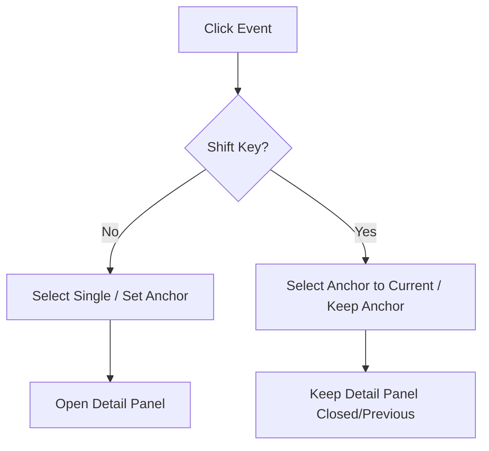

# Architectural Specification - Multi-Select Behavior

## 1. Requirement Mapping
- **Shift+Click Reliability**: Must select a stable range from an "anchor" row to the target row.
- **Text Selection Prevention**: Standard browser "blue highlight" must not trigger during row range selection.
- **UI Item Isolation**: Checkboxes and action buttons must be exempt from text drag-selection to avoid messy UI states.
- **Intentional Text Selection**: Dragging over text content should still allow normal selection without changing row state.

## 2. Options Evaluation
- **Text Selection**:
    - *Option 1*: `user-select: none` on the whole table. (Too restrictive)
    - *Option 2*: `preventDefault()` on `mousedown` if `shiftKey` is true. (**Selected**: Simple, zero-flicker, stops selection before it starts).
- **Range Logic**:
    - *Option 1*: Use last element of `selectedRows` Set. (Unreliable, Set iteration order is insertion order, not visual order).
    - *Option 2*: Maintain a `lastClickedRowRef` (anchor). (**Selected**: Industry standard for Explorer/macOS selection).

## 3. Specification

### Data Flow & State
- **Anchor State**: Managed via `useRef<string | null>` in the View component. Not in Global State (Jotai) to avoid unnecessary re-renders during drag/select phases.
- **Selection State**: Remains in `selectedHistoryRowsAtom` (Jotai).

### Component Hierarchy
- **DataTable**: Responsible for low-level event interception (`preventSelection`).
- **ReviewView**: Responsible for higher-level selection logic (calculating ranges).

### State Management Logic (handleRowClick)

## 4. Risk Analysis

| Risk | Mitigating Action |
| :--- | :--- |
| **Links in Rows** | Links will Use `onClick` with `e.stopPropagation()`. `preventDefault` on `mousedown` will not stop Link execution. |
| **Checkboxes** | Checkboxes will be styled with `user-select: none` to prevent "blue ghosting" during drag. |
| **Performance** | Range calculation uses `indexOf` on a 500-item array. O(N) is <1ms, well within 60fps budget. |

## Bug Fix: Range Selection Order Reliability
> [!IMPORTANT]
> The current range logic uses `loadedData`, which is the raw data array. However, `DataTable` applies its own sorting and filtering. To fix the "spotty" selection, the View needs the *visual* order of IDs.

### Changes
-   **DataTable.tsx**: Update `onRowClick` and `onRowDoubleClick` to also receive the current list of sorted row IDs.
-   **View Components**: Update selection logic to use the provided visual IDs instead of `loadedData`.

## 5. File Manifest

### Components
- [EnhancedHistoricalReviewView.tsx](file:///c:/Users/dthompson/Documents/CODE/safeguard-desktop/src/desktop-enhanced/components/EnhancedHistoricalReviewView.tsx): Implement `lastClickedRowRef` and range logic.
- [HistoricalReviewView.tsx](file:///c:/Users/dthompson/Documents/CODE/safeguard-desktop/src/desktop/components/HistoricalReviewView.tsx): Implement `lastClickedRowRef` and range logic.
- [DataTable.tsx](file:///c:/Users/dthompson/Documents/CODE/safeguard-desktop/src/desktop/components/DataTable.tsx): Add `onMouseDown` to `tr` with `preventSelection` logic.

### Styles
- [DataTable.module.css](file:///c:/Users/dthompson/Documents/CODE/safeguard-desktop/src/desktop/components/DataTable.module.css): Add `user-select: none` to UI primitives (checkbox, actions).
