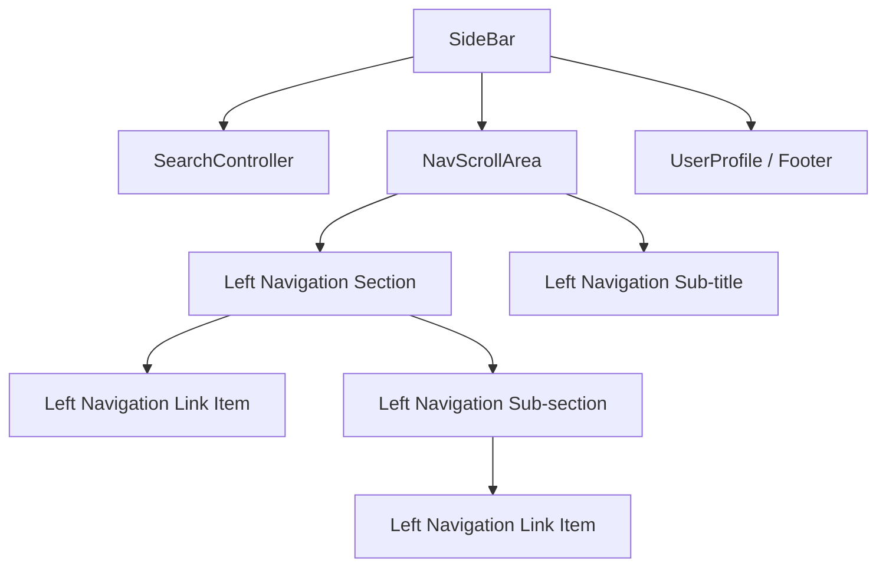

# Architecture: Left Navigation Components

## 1. Component Hierarchy
We will implement a recursive, data-driven navigation system based on the `Journal Design System`.



### Components Definition (Terminology)
1.  **`SideBar.tsx`**: Main container. Handles expansion/collapse.
2.  **`LeftNavigationSection.tsx`**: Top-level group with bold header and toggle.
3.  **`LeftNavigationSubSection.tsx`**: Nested folder-like group.
4.  **`LeftNavigationLinkItem.tsx`**: Terminal interactive node (Link).
5.  **`LeftNavigationSubTitle.tsx`**: Static heading (`h3`/`h4`).
6.  **`SearchController.tsx`**: Specialized search area with collapse trigger.

## 2. State Management (Jotai)
### `sidebarAtom.ts`
```typescript
import { atom } from 'jotai';

export const sidebarExpandedAtom = atomWithStorage('sidebar-expanded', true);
export const sidebarSearchQueryAtom = atom('');
```

## 3. Data Structure
```typescript
interface NavNode {
  type: 'section' | 'sub-section' | 'link' | 'sub-title' | 'divider';
  id: string;
  label: string;
  icon?: string;
  href?: string;
  children?: NavNode[]; // Recursive for sections/sub-sections
  selected?: boolean;   // For Link Items
}
```

## 4. CSS Strategy (Atomic Tokens)
*   **Section Header**: `color: var(--control-fg-faint)` (#436289)
*   **Link Item (Default)**: `color: var(--control-fg-faint)`
*   **Link Item (Selected)**: `background-color: var(--surface-bg-sunken)`, `color: var(--control-fg-secondary)` (#223a58)
*   **Link Item (Dark Active)**: Inverted variant for special items (e.g. Search Case).

## 5. Accessibility
*   **Enter/Space**: Toggle expansion.
*   **Aria**: `aria-expanded` and `role="menuitem"`.
*   **Focus**: Custom double-ring `box-shadow` on focus-visible.
