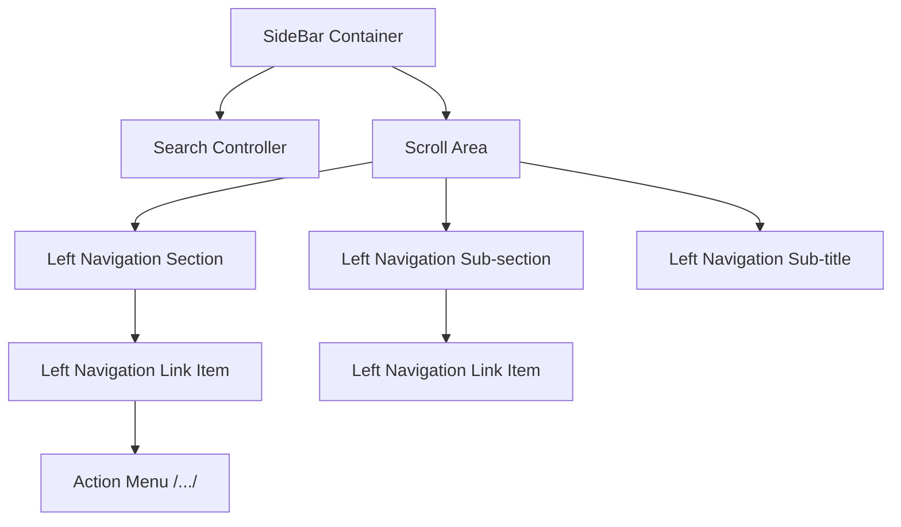

# Atomic Specifications: Left Navigation

## 1. The Atomic Hierarchy (Relations)
A recursive, data-driven structure matching the `Journal Design System`.

---

## 2. Component Specs (Atoms)

### A. Search Controller
*   **Contains**: `Search Input`, `Collapse Button`.
*   **Ref**: [ATOM-SearchController.md](./specs/ATOM-SearchController.md)

### B. Left Navigation Section
*   **Visual**: Header with Toggle, Bold Text.
*   **Ref**: [ATOM-NavSection.md](./specs/ATOM-NavSection.md)

### C. Left Navigation Sub-section
*   **Visual**: Nested toggle group.
*   **Ref**: [ATOM-NavSubSection.md](./specs/ATOM-NavSubSection.md)

### D. Left Navigation Link Item
*   **Visual**: The terminal icon + text link.
*   **Ref**: [ATOM-NavLinkItem.md](./specs/ATOM-NavLinkItem.md)

### E. Left Navigation Sub-title
*   **Visual**: Static categorization heading.
*   **Ref**: [ATOM-NavSubTitle.md](./specs/ATOM-NavSubTitle.md)

---

## 3. Interaction & Data Flow
| Action | Impacted Atom | State Change |
| :--- | :--- | :--- |
| **Click Section Header** | `Left Navigation Section` | Toggle `aria-expanded`. Show/hide children. |
| **Click Sub-section** | `Left Navigation Sub-section` | Recursive toggle for nested items. |
| **Select Link Item** | `Left Navigation Link Item` | Set state to `Selected` (Sunken BG). Navigate. |
| **Click Collapse** | `SideBar` | Toggle `sidebarExpandedAtom`. |

---

## 4. State Dependency Matrix
| Parent Atom | Child Property | Relation |
| :--- | :--- | :--- |
| **SideBar** (Collapsed) | **Link Item** | Label hidden. Icon centered. Tooltip active. |
| **Section** (Closed) | **Children** | `display: none` for all sub-nodes. |
| **Link Item** (Selected) | **Typography** | Font-weight: Semibold (600). |

