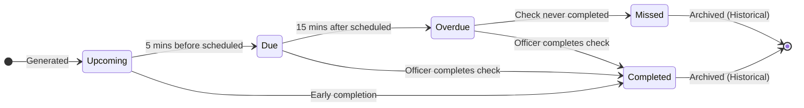
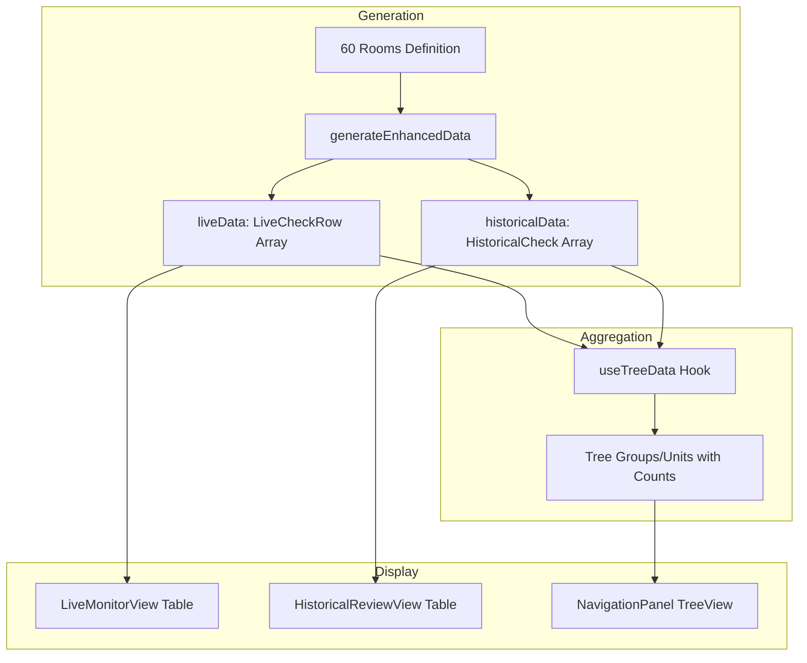

# Check Lifecycle Specification

> [!NOTE]
> This document describes the lifecycle of a Safety Check as represented in the Desktop Supervisor Dashboard.

---

## Overview

A **Safety Check** represents a scheduled welfare verification for a resident at a specific location. The lifecycle progresses through states based on time relative to the scheduled check time.



---

## Live View States

In the **Live Monitor View**, checks exist in one of three states:

| Status | Timer Severity | Time Offset | Description |
|--------|----------------|-------------|-------------|
| `upcoming` | `info` | > 5 mins before scheduled | Check is scheduled but not yet actionable |
| `due` | `warning` | ±5 mins of scheduled time | Check is in the grace window, action recommended |
| `overdue` | `alert` | > 15 mins past scheduled | Check is missed and requires immediate attention |

### State Transition Logic

From [mockData.ts](file:///c:/Users/dthompson/Documents/CODE/safeguard-desktop/src/desktop-enhanced/data/mockData.ts#L116-L141):

```typescript
if (deltaMinutes > 15) {
    liveStatus = 'overdue';
} else if (deltaMinutes >= 0) {
    liveStatus = 'due';         // 0-5 mins past
} else if (deltaMinutes >= -5) {
    liveStatus = 'due';         // 1-5 mins before
} else {
    liveStatus = 'upcoming';    // > 5 mins before
}
```

---

## Historical View States

In the **Historical Review View**, checks are archived with these statuses:

| Status | Variance | Description |
|--------|----------|-------------|
| `completed` | < 2 mins late | Check was done on time |
| `missed` | ∞ (never done) | Check was never completed |

### Review Workflow

| Review Status | Meaning |
|---------------|---------|
| `pending` | Missed check awaiting supervisor explanation |
| `verified` | Supervisor has reviewed and added a note |

---

## Data Flow



---

## Key Interfaces

### LiveCheckRow (Live View)

```typescript
interface LiveCheckRow {
    id: string;
    status: 'upcoming' | 'due' | 'overdue';
    timerText: string;
    timerSeverity: 'alert' | 'warning' | 'info';
    location: string;
    residents: Resident[];
    hasHighRisk: boolean;
    group: string;
    unit: string;
    lastCheckTime: string | null;
    lastCheckOfficer: string | null;
    supervisorNote?: string;
}
```

### HistoricalCheck (Historical View)

```typescript
interface HistoricalCheck {
    id: string;
    residents: Resident[];
    location: string;
    scheduledTime: string;
    actualTime: string | null;
    varianceMinutes: number;
    status: 'completed' | 'missed';
    group: string;
    unit: string;
    officerName: string;
    officerNote?: string;
    supervisorNote?: string;
    reviewStatus: 'pending' | 'verified';
}
```

---

## Timing Constants

| Constant | Value | Purpose |
|----------|-------|---------|
| `CHECK_INTERVAL_MINS` | 15 | Minutes between scheduled checks per room |
| `HISTORY_HOURS` | 24 | Hours of historical data retained |
| Grace Window | ±5 mins | Due state threshold around scheduled time |
| Overdue Threshold | +15 mins | When a check becomes overdue |

---

## Room Distribution

The mock data generator creates **60 rooms** with deterministic status distribution:

- **Rooms 0-9**: Always `overdue` (20-29 mins past scheduled)
- **Rooms 10-19**: Always `due` (-5 to +4 mins of now)
- **Rooms 20-59**: Always `upcoming` (5-44 mins in future)

This ensures a balanced mix for testing all UI states.
