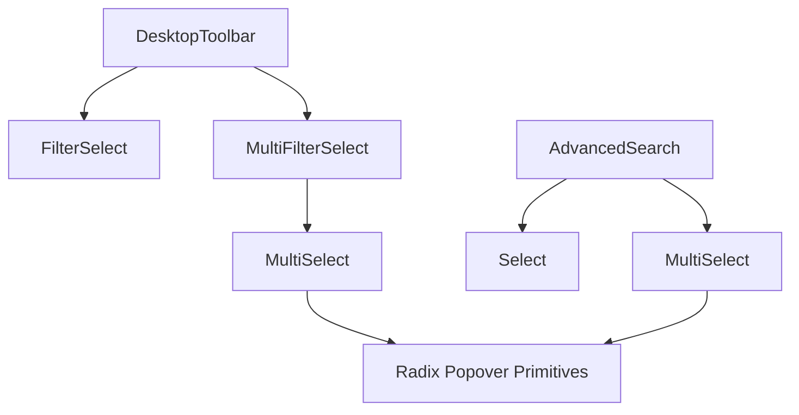

# ARCH: MultiSelect Architectural & Visual Parity

## Component Hierarchy


## Step-by-Step Implementation Guide

### Step 1: Standardize MultiSelect.tsx
**File**: `src/components/MultiSelect.tsx`

Ensure the trigger pass-throughs are complete. Junior developers often forget `data-state`, which breaks the caret transition.
```tsx
// 1. Pass triggerClassName to the button
<button className={`${styles.trigger} ${triggerClassName || ''}`} ... >

// 2. PASS data-state for caretaker animation
data-state={open ? 'open' : 'closed'}
```

**Crucial**: Refactor the item from a `div` to a `button` so it is "clickable" by the browser's accessibility engine and focusable via keyboard.
```tsx
<button
    key={option.value}
    className={`menuItem ${styles.item}`} // USE menuItem global class
    onClick={() => handleSelect(option.value)}
    data-state={value.includes(option.value) ? 'checked' : 'unchecked'}
    type="button"
>
```

### Step 2: Form Parity in AdvancedSearch
**File**: `src/desktop/components/AdvancedSearch.tsx`

Apply the `selectTrigger` style to the MultiSelect. This is the single most important step for visual parity.
```tsx
<MultiSelect
    value={localFilter.historicalStatusFilter}
    onValueChange={(val) => handleChange('historicalStatusFilter', val)}
    placeholder="All statuses"
    options={HISTORICAL_STATUS_OPTIONS}
    triggerClassName={styles.selectTrigger} // MUST BE PRESENT
/>
```

### Step 3: Toolbar Parity in MultiFilterSelect
**Files**: `src/desktop/components/MultiFilterSelect.tsx` and `src/desktop/components/FilterSelect.module.css`

Ensure the container height is explicitly 36px and the clear button uses the `close` symbol.
```tsx
// MultiFilterSelect.tsx
<div className={`${styles.container} ${isCustomized ? styles.activeContainer : ''}`} style={{ height: 36 }}>
    <MultiSelect variant="filter" ... />
    <button className={styles.clearButton} ...>
        <span className={`material-symbols-rounded ${styles.clearIcon}`}>close</span>
    </button>
</div>
```

## Risk Analysis

| Risk | Impact | Mitigation |
| :--- | :--- | :--- |
| **Nested Interactive Elements** | High (Crash/Jank) | Ensure the item is a single `<button>` or `<label>`, not a `div` containing a `button`. |
| **Width Overflow** | Med | MultiSelect trigger MUST use `width: auto` in its base CSS so it doesn't stretch the Toolbar. |
| **Focus Rings** | Low | Verify `Select.module.css` and `MultiSelect.module.css` both use `var(--control-focus-ring-standard)`. |

## Common Mistakes to Avoid
1. **Mistake**: Using `data-selected` instead of `data-state="checked"`.
   **Fix**: Standard app styles rely on `[data-state="checked"]` for menu items.
2. **Mistake**: Hardcoding 48px height in MultiSelect.
   **Fix**: Height must come from the `triggerClassName` passed by the Parent.
