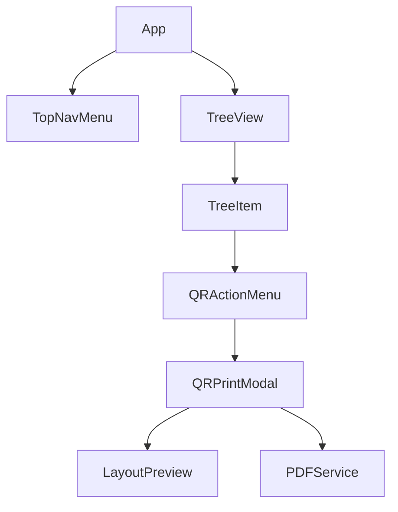

# Architecture Spec: QR Code Generation

## 1. Requirement Mapping
- **Global Toggle**: Managed by a Jotai atom, persisted to local storage.
- **Context Menu**: Injected into `TreeView.tsx` using Radix `DropdownMenu`.
- **PDF Core**: `jsPDF` for document structure, `qrcode` for matrix generation.
- **Physical Accuracy**: 1 inch unit mapping (72pt/inch).

---

## 2. Component Hierarchy



---

## 3. Data Model & State

### Atoms (`src/desktop-enhanced/atoms.ts`)
```typescript
interface QRPrintOptions {
  size: number;          // 1.0 to 2.5 (inches)
  layout: 'standard' | 'branded';
  labelPosition: 'top' | 'bottom';
  fontSize: number;      // 10 to 24 (pt)
  includeUnit: boolean;  // For 'branded' layout
}

export const qrGenEnabledAtom = atomWithStorage('qr_gen_enabled', false);
export const qrPrintOptionsAtom = atom<QRPrintOptions>({
  size: 2.0,
  layout: 'standard',
  labelPosition: 'bottom',
  fontSize: 14,
  includeUnit: true
});
```

---

## 4. Logical Specifications

### PDF Grid Generation Algorithm
To maximize labels per page while maintaining the user's selected size:

1. **Page Context**: 8.5" x 11" (Letter), Margins = 0.5". Safe Area = 7.5" x 10.0".
2. **Item Geometry**: 
   - `item_w = size`
   - `item_h = size + (fontSize / 72) + padding`
   - `gap = 0.25"`
3. **Calculations**:
   - `cols = floor((SafeWidth + gap) / (item_w + gap))`
   - `rows = floor((SafeHeight + gap) / (item_h + gap))`
4. **Page Break**: If `index % (cols * rows) === 0`, trigger `doc.addPage()`.

### Room Collection Logic (Recursion)
When a Wing or Facility node is selected:
- **Input**: `nodeId`
- **Process**: Perform a depth-first search (DFS) through the `facilityNodes` data.
- **Output**: An array of `Room` objects containing `{ id: string, name: string, unitName?: string }`.
- **Handoff**: Pass this array directly to the `PDFService`.

### Physical Scaling (Safe mapping)
`jsPDF` should be initialized with `unit: 'in'`.
- QR Code: `doc.addImage(data, 'PNG', x, y, size, size)`
- Font: `doc.setFontSize(fontSize)` (Note: jsPDF uses pts, so no conversion needed if target is pts).

---

## 5. Failure Modes & Mitigations

| Failure Mode | Risk | Mitigation |
|---|---|---|
| **Low Contrast QR** | Scan failure | Enforce minimum 0.1" white quiet zone (margin) around the QR. |
| **Large Text Overflow** | Text cut off | Implement basic `truncate` logic or `maxWidth` for room names. |
| **Memory Leaf** | App crash | For large wings (>100 rooms), generate PDFs in batches of 50 or use a web worker for image generation. |
| **Printer Scaling** | Physical size wrong | **Hard requirement**: Include a 1-inch reference line on the PDF header. |
